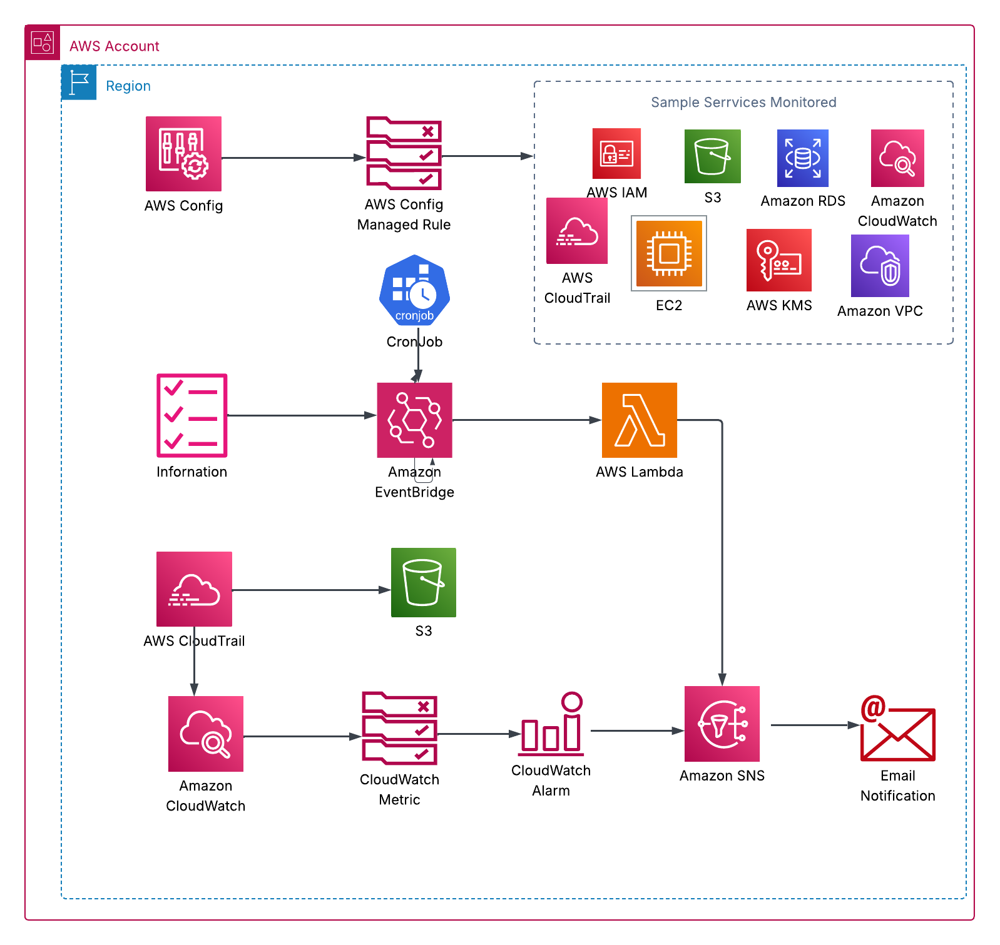

# aws-cis-level1-automation
We build a baseline automation solution to ensure compliance with  CIS AWS Foundations Benchmark level 1 compliance, to protect organizations against the indelible reality of high severity cloud cyber attack.

## a. Prerequisites

1. **Coding**  
   - Install Visual Studio Code (VSC) or any preferred code development tool.  
   - Create a branch for each development feature and merge into the `main` branch via pull requests.

2. **Git / GitHub**  
   - Create a GitHub account and install Git on your local machine or dev environment.  
   - Configure credentials to clone, push, and pull code to/from the remote repo.

3. **AWS**  
   - Sign up for a free-tier AWS account following best security practices.  
   - Create an **admin** account with full privileges, then use it to create a **dev** user with least-privilege access.  
   - Generate and securely store access keys (do _not_ use your root account).  
   - Install and configure the AWS CLI locally in VSC with your dev user’s access keys.  
   - In the AWS Console, create a CloudWatch Log Group named:
     - `/aws/cloudtrail/logs/`
       
   - Delete any existing IAM roles named:
     - `aws-config-role`
     - `cis1_1-contact-check-role*`

4. **Terraform**  
   - Download and install Terraform in your dev environment.  
   - Verify it’s properly configured to work with your AWS credentials.

## Architecture
We built the architecture below for our solution, using AWS services. Our solution uses three main design patterns to automate compliance:

1. Controls detected by setting up AWS config Managed rule. Example: CIS 1.3 Ensure no 'root' user account access key exists
2. Controls detecting a particular event, generating cloudwatch alarms, and alerts for review and remediation. Example: CIS 4.3 Ensure usage of the 'root' account is monitored 
3. Controls continuously checking if manual configuration is set-up, based on a cron event driven pattern, and alerts for manual remediation. Example: CIS 1.1  Maintain current contact details 

here is the architecture for this end-to-end automation: 

Mapping table of some CIS AWS Controls implemented as per above architecture:

| CIS AWS Foundations  Benchmark Control                                                                  |  Main AWS Services                            | Compliance Goal                                                                                          | AWS Config Managed Rule / Metrics / CloudTrail API Logs  |
|---------------------------------------------------------------------------------------------------------|-----------------------------------------------|----------------------------------------------------------------------------------------------------------|----------------------------------------------------------|
| 1.1  Maintain current contact details                                                                   | Lambda + CloudWatch EnventBridge (cron) + SNS | Continuously checks if control is in place and alerts for manual remediation                             | N/A                                                      |
| 1.3 Ensure no 'root' user account access key exists                                                     | AWS Config                                    | AWS Config continuously monitors control and returns Compliant/Non Compliant Status.                     | iam-root-access-key-check                                |
| 1.4 Ensure MFA is enabled for the 'root' user account                                                   | AWS Config                                    | AWS Config continuously monitors control and returns Compliant/Non Compliant Status.                     | root-account-mfa-enabled                                 |
| 1.7 Ensure IAM password policy requires minimum length of 14 or greater                                 | AWS Config                                    | AWS Config continuously monitors control and returns Compliant/Non Compliant Status.                     | IAM_PASSWORD_POLICY                                      |
| 1.9 Ensure multi-factor authentication (MFA) is enabled for all IAM users that have a console password  | AWS Config                                    | AWS Config continuously monitors control and returns Compliant/Non Compliant Status.                     | MFA_ENABLED_FOR_IAM_CONSOLE_ACCESS                       |
| 1.6 Eliminate use of the 'root' user for administrative and daily tasks                                 | CloudWatch(Event Bridge) + CloudTrail + SNS   | Detects root account  use / activity and  sends an alert for manual review or remediation - event driven | API Log:  ConsoleLogin userIdentity.type = “Root”        |
| 1.10 Do not create access keys during initial setup for IAM users with a console password               | CloudWatch(Event Bridge) + CloudTrail + SNS   | Detects and alert for manual review / remediation                                                        | API Logs:CreateUser, CreateLoginProfile, CreateAccessKey |
| 4.3 Ensure usage of the 'root' account is monitored                                                     | CloudWatch (Alarms)  + SNS                    | Detect and  alert  for review and action                                                                 | Metric: userIdentity.type = “Root”                       |
| 4.8 Ensure S3 bucket policy changes are monitored                                                       | CloudWatch (Alarms)  + SNS                    | Detect and  alert  for review and action                                                                 | Metric: PutBucketPolicy                                  |

## Tools and Technologies

This automation uses the following tools and technologies:

| Tool                                        | Purpose                                                                                                                                                                                                                    |
|---------------------------------------------|----------------------------------------------------------------------------------------------------------------------------------------------------------------------------------------------------------------------------|
| Code                                        | Uses Git as VCS and Github as code repository                                                                                                                                                                              |
| CI/CD                                       | Uses Github Actions to automate deployment process, triggered on push to main branch                                                                                                                                       |
| Infrastructure as Code - Iac                | Uses Terraform  as Iac tool to describe infrastructure  in declarative way                                                                                                                                                 |
| Secrets                                     | Uses Github secrets  to  protect secrets- AWS Access Key, secrets key,  and region; add them under your github repo- > settings -> secrets and variables -> action; Use GitLeaks to scan secrets  in the code (optional).  |
| State Locking                               | Configured to protect state and prevent conflicts (optional)                                                                                                                                                               |
| Notifications                               | Alerts sent via email                                                                                                                                                                                                      |
| Code Validation                             | Uses Terraform fmt for code formatting, terraform validate for syntax validation. Uses tlint for linting to ensure code quality and enforce best coding practices.                                                         |
| Iac Vulnerabilities Scanning                | Uses Tfsec and Checkov  to scan for misconfigurations and vulnerabilities in the code                                                                                                                                      |
| Software Composition Analysis - SCA         | Scan for insecure modules and licence compliance with Checkov. Trivy is an option out of scope for this project.                                                                                                           |
| Static Analysis Security Testing - SAST     | Uses Checkov and Tfsec. Terrascan is an option out of scope for this project.                                                                                                                                              |
| Dynamic Application Security Testing - DAST | No strictly needed since it is not a full application running in a production environment. But could also be implemented.                                                                                                  |
| Drift detection                             | Uses Driftctl. Out-of-scope for this project.                                                                                                                                                                              |
## Use
How to use the automation solution:
- setup pre-requisites
- clone this repository
- cd to folder
- create a feature branch 
- edit a file and add your email adress for notificaation 
- commit and push code
- open and approve pull request
- review actions tap on GitHub and edit any bug
- approve subscriptions notification
- review  aws config dashboard, cloudwatch alarms and sns subscriptions

## Clean-UP
We provided a clean-up workflow based on a cron-job to avoid incuring any cost associated with testing this automation. This file can be ommitted when permanently adopting the solution.

## Contributions Welcome

We love and encourage contributions to this project!

By contributing, you agree to retain attribution to the original authors of this repository. If you use significant parts of this code in your own project (including forks), please mention or link back to this repo.

## License

This project is licensed under the [MIT License](./LICENSE).  
See the `LICENSE` file for the full text.

## Copyright (c) 2025 [Nicole T. K.]
